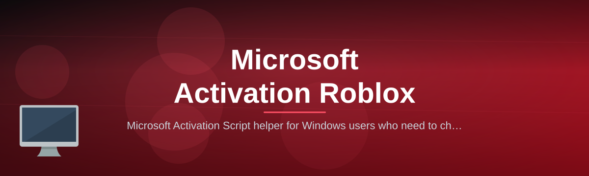

 

  
  
  

  

  
  
  

---

**Microsoft Activation Script** is a portable Windows utility that reads the licensing state of a machine you own or administer, records it in a file you control, and puts it back exactly the way it was when something goes wrong. It is a single `.exe`. No installer, no runtime downloads, no Python, no package manager.

| Category | Details |
| --- | --- |
| Project | Microsoft Activation Script |
| Current release | v2.7.3 "Ledger" — February 2026 |
| Category | Windows licensing inspection, archival and restore utility |
| Platform | Windows 10 / 11 / Server 2016–2025 (x64; ARM64 via emulation) |
| Distribution | One portable `.exe` inside a ZIP archive |
| Interface | Console UI with colour output, plus optional HTML/CSV/JSON reports |
| Footprint | ~48 MB extracted; nothing left behind once Uninstall Cleaner runs |
| Release cadence | Roughly every 6 weeks, hotfixes as needed |
| Maintained by | One maintainer, dogfooded on my main desktop every single day |

I built this because I got tired of reading 200 lines of `slmgr` output to answer one question: *is this machine actually activated, and how?* The built-in tools tell you something is wrong and give you a hex code. They don't tell you which channel you're on, when the license was bound, what the hardware hash is, or how to get all of that back after you swap a motherboard. This script does all four, and it writes everything down in a format you can read six months later.

Everything the script does is aimed at licenses you already own or that your organisation is already entitled to. It does not generate keys, it does not patch binaries, and it does not talk to any server we operate.

---

## ⬇️ Download

The release archive is a single ZIP containing the `.exe`, a plain-text short manual, and a checksum file. Extract it anywhere — Desktop, a tools folder, or a USB stick. There is no setup step and no registry hook.

  

After extracting, verify the SHA-256 of the `.exe` against the checksum listed on the release page before the first run. That takes ten seconds and tells you the file arrived intact. Then double-click it.

---

## 💾 System Requirements

The tool is deliberately light. If a machine can run Windows 10, it can run this.

| Component | Minimum | Recommended |
| --- | --- | --- |
| Windows version | Windows 10 1809 (x64) | Windows 11 24H2 or Server 2025 |
| Edition | Home, Pro, Enterprise, Education, IoT LTSC | Pro / Enterprise / LTSC |
| CPU | 1 GHz dual-core | Any x64 CPU from the last decade |
| RAM | 2 GB | 8 GB |
| Free storage | 60 MB | 250 MB (room for several archive bundles) |
| .NET Framework | 4.7.2 | 4.8.1 |
| PowerShell | 5.1 (already present) | 5.1 with execution policy set to

  

